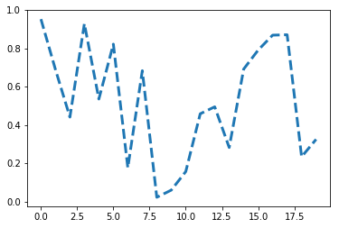

# Trying Jupyter Notebook

Here I'm running code:


```python
print('hello world!')
```

LaTeX: $\mathbb{A}=\mathcal{B}+C^d_E$


```python
%pylab
```

    Using matplotlib backend: Qt5Agg
    Populating the interactive namespace from numpy and matplotlib
    


```python
 x = randn(100)
```


```python
figure()
```


    <Figure size 432x288 with 0 Axes>


    <Figure size 432x288 with 0 Axes>


```python
y = randn(100)
plot(rand(20), mfc='g', mec='r', ms=40, mew=4, ls='--', lw=3)
```


    [<matplotlib.lines.Line2D at 0x28e2308e2e8>]




